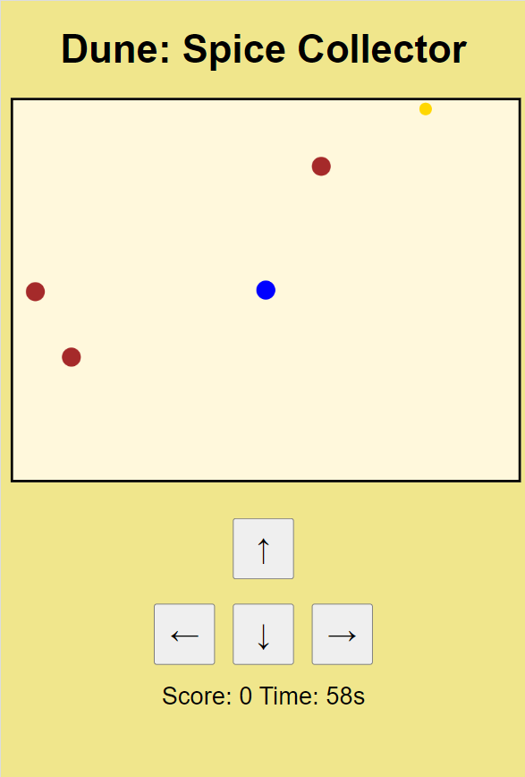

# Dune: Spice Collector

## Game Description

**Dune: Spice Collector** is a fun, browser-based arcade game inspired by the Dune universe. Players must collect valuable spice while avoiding deadly sandworms. The objective is to collect as much spice as possible before the timer runs out or the player is caught by a sandworm. The game is playable on both desktop and mobile devices, with touch controls available for mobile users.

## Features

- **Spice Collection**: Collect spice (golden circles) to increase your score by 10 points for each spice.
- **Sandworms**: Avoid the deadly sandworms (brown circles). If you collide with one, the game ends.
- **Time Limit**: You have 60 seconds to collect as much spice as you can.
- **Score and Timer**: Keep track of your current score and the time remaining on the screen.
- **Mobile and Desktop Support**: Play with keyboard controls on desktops or touch controls on mobile devices.

## To Play the game

To play the game online: [Dune: Spice Collector](https://grizzlypeaksoftware.github.io/dune/)

## Getting Started

### Prerequisites

To play **Dune: Spice Collector**, you'll need:

- A modern web browser (Chrome, Firefox, Edge, Safari).

### How to Play

1. Clone or download this repository.
2. Open the `index.html` file in your browser.
3. Control your player using either keyboard keys (desktop) or touch buttons (mobile) to collect spice and avoid sandworms.

### Controls

#### Desktop:
- `W` or `Arrow Up` - Move Up
- `A` or `Arrow Left` - Move Left
- `S` or `Arrow Down` - Move Down
- `D` or `Arrow Right` - Move Right

#### Mobile:
- Use the on-screen directional buttons to move your character.

### Game Objective

- Collect as much spice as possible while avoiding sandworms.
- The game ends when the timer runs out (60 seconds) or when your player collides with a sandworm.

### Mobile Controls

The game includes touch controls for mobile devices. These controls are automatically displayed on smaller screens and are located below the game canvas to avoid covering the gameplay area.

## Future Enhancements

- Add power-ups for temporary boosts (e.g., increased speed, immunity from sandworms).
- Increase difficulty by spawning more sandworms as the game progresses.
- Introduce different levels or terrains with new challenges.

## Screenshot

## License

This project is licensed under the MIT License. See the [LICENSE](./LICENSE) file for more details.

---

Enjoy collecting spice, and watch out for the sandworms!